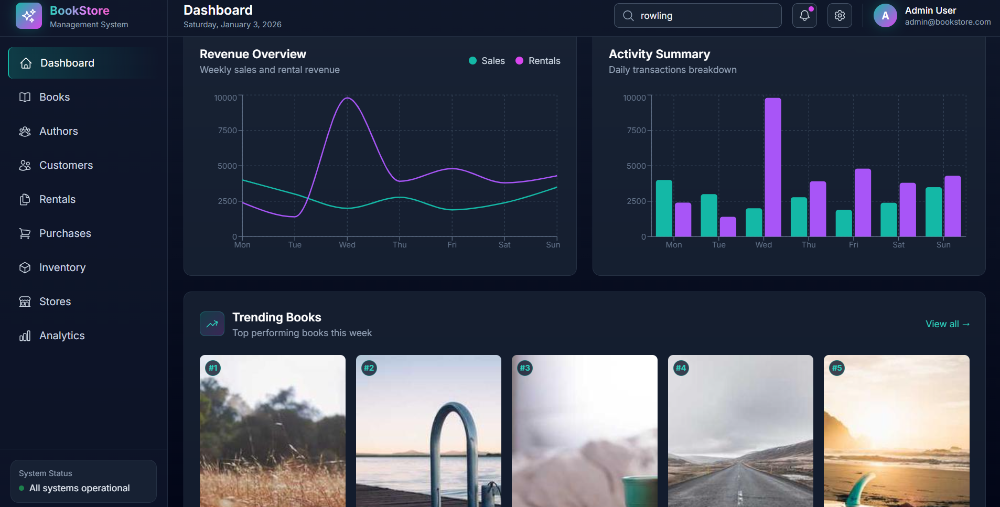
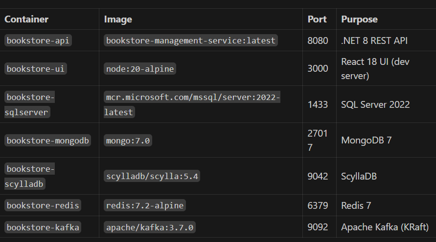
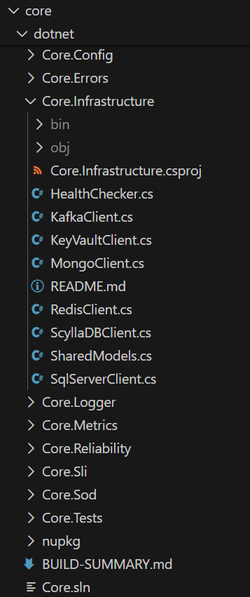
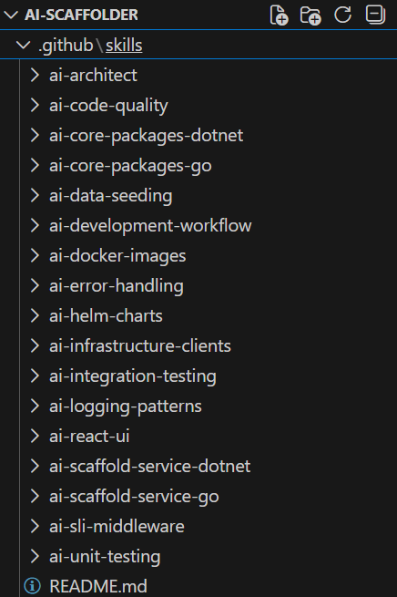

<div align="center">

# 🤖 AI Scaffolder

### One prompt. Complete application. Running in minutes.

[](https://dotnet.microsoft.com/)
[](https://golang.org/)
[](https://python.org/)
[](https://reactjs.org/)
[](https://www.typescriptlang.org/)

[](https://www.microsoft.com/sql-server)
[](https://www.mongodb.com/)
[](https://www.scylladb.com/)
[](https://redis.io/)
[](https://kafka.apache.org/)

[](https://www.docker.com/)
[](https://kubernetes.io/)
[](https://helm.sh/)
[](https://vitejs.dev/)
[](https://tailwindcss.com/)

<br/>

*AI-powered code generation using Claude Opus 4.5 with specialized Agent Skills*

*Transforms natural language → Production-ready full-stack applications*

</div>

---

---

## See It In Action

**This complete bookstore management system was built from a 10-line prompt:**



```
Implement a bookstore management system with:
- Books with title, ISBN, price, and cover images
- Authors with biography and photo
- Customers with membership tiers
- Book rentals with due dates
- Purchases with payment tracking
- Inventory per store location
- Dashboard with sales analytics
```

**Result:** Full .NET 8 API, React 18 UI with Dark Tech Theme, SQL Server + MongoDB + ScyllaDB + Redis + Kafka, Docker Compose, Helm charts, 52 unit tests—all generated and running.

**7 containers deployed with `docker-compose up -d`:**



---

## What It Does

**You describe what you want:**
```
"Build a bookstore management system with books, authors, customers, 
rentals, and purchases. Need inventory tracking per store location."
```

**AI generates a complete application:**
- ✅ .NET 8 or Go backend with REST API
- ✅ React 18 UI with Dark Tech Theme
- ✅ SQL Server, MongoDB, ScyllaDB, Redis, Kafka (as needed)
- ✅ Docker Compose for local development
- ✅ Helm charts for Kubernetes deployment
- ✅ Unit tests with 80% coverage
- ✅ Seed data for all databases

---

## How It Works

```
┌─────────────────────────────────────────────────────────────────────┐
│                         YOUR PROMPT                                 │
│                                                                     │
│  "I need an order management system. Customers place orders,        │
│   we validate inventory, process payments, send notifications.      │
│   Orders searchable by customer and date. High volume during        │
│   sales events."                                                    │
│                                                                     │
└─────────────────────────────────────────────────────────────────────┘
                                 ↓
                    ┌────────────────────────┐
                    │   CLAUDE OPUS 4.5      │
                    │   + Agent Skills       │
                    └────────────────────────┘
                                 ↓
┌─────────────────────────────────────────────────────────────────────┐
│                    PHASE 0: ARCHITECTURE                            │
│                                                                     │
│  AI analyzes your use case and decides:                             │
│                                                                     │
│  📊 SQL Server → Orders, Customers, Products (ACID transactions)    │
│  📦 ScyllaDB  → Order events by timestamp (time-series, TTL)        │
│  🔴 Redis     → Shopping carts, inventory cache (sub-ms reads)      │
│  📨 Kafka     → order.created, payment.processed (event streaming)  │
│  🖥️ React UI  → Dashboard, Order List, Customer Management          │
│                                                                     │
└─────────────────────────────────────────────────────────────────────┘
                                 ↓
┌─────────────────────────────────────────────────────────────────────┐
│              13-PHASE CODE GENERATION & VERIFICATION                │
│                                                                     │
│  Phase 1:   Generate Code & Seed Files                              │
│  Phase 2:   Build Locally & Fix Errors                              │
│  Phase 2.5: Code Quality (Format & Lint)                            │
│  Phase 3:   Unit Tests (80% coverage)                               │
│  Phase 4:   Build Docker Image                                      │
│  Phase 5:   Deploy Docker Compose                                   │
│  Phase 6:   Seed ALL Databases                                      │
│  Phase 7:   Integration Tests (API)                                 │
│  Phase 8:   Integration Tests (UI)                                  │
│  Phase 9:   Generate Helm Chart                                     │
│  Phase 10:  Final Delivery                                          │
│                                                                     │
└─────────────────────────────────────────────────────────────────────┘
                                 ↓
┌─────────────────────────────────────────────────────────────────────┐
│                   COMPLETE APPLICATION                              │
│                                                                     │
│  order-management/                                                  │
│  ├── src/                        # .NET 8 or Go backend             │
│  ├── ui/                         # React 18 + Tailwind              │
│  ├── scripts/                    # Database seed scripts            │
│  ├── helm/                       # Kubernetes charts                │
│  ├── docker-compose.yml          # Local infrastructure             │
│  └── Dockerfile                  # Production build                 │
│                                                                     │
│  docker-compose up -d            → Running locally in minutes       │
│  helm install order-mgmt ./helm  → Deployed to Kubernetes           │
│                                                                     │
└─────────────────────────────────────────────────────────────────────┘
```

---

## The AI Architect

Claude Opus 4.5 doesn't just generate code—it **architects** your application by analyzing your use case and making intelligent decisions about data platforms:

### Database Selection Logic

| When You Describe... | AI Chooses | Because |
|---------------------|------------|---------|
| "Customers place orders with items" | **SQL Server** | Transactional integrity, foreign keys, ACID |
| "Order history searchable by date" | **ScyllaDB** | Time-series queries, partition by date |
| "Real-time inventory counts" | **Redis** | Sub-millisecond reads, atomic operations |
| "Documents with flexible fields" | **MongoDB** | Schema flexibility, nested data |
| "Notify when status changes" | **Kafka** | Event streaming, decoupled services |

### Example Architecture Decision

**Your prompt:**
```
"IoT sensor dashboard. 10,000 devices send temperature readings every 
5 seconds. Alert when thresholds exceeded. Show real-time charts."
```

**AI determines:**
```yaml
# 200 writes/second = time-series workload → ScyllaDB
scylladb:
  sensor_readings:
    partition_key: device_id
    clustering: timestamp DESC
    ttl: 7 days

# Device config, alerts, users need ACID → SQL Server
sqlserver:
  - devices (id, name, location, thresholds)
  - alerts (id, device_id, severity, acknowledged)
  - users (id, email, role)

# Dashboard needs instant reads → Redis
redis:
  - device:{id}:latest → current reading
  - alerts:active → set of active alert IDs

# Decouple ingestion from alerting → Kafka
kafka:
  - sensor.readings (partitions: 24)
  - alerts.triggered (partitions: 6)
```

---

## Example Prompts

Just describe what you need. The AI handles everything else.

### Simple Services

```
"Build a todo list API with tasks and categories"
```

```
"Create a blog with posts, comments, and user authentication"
```

```
"I need a simple inventory tracker for a small warehouse"
```

### Business Applications

```
"Build a bookstore like Barnes & Noble. Manage books, authors, 
customers. Support both rentals and purchases. Track inventory 
across multiple store locations."
```

```
"Order management system. Customers place orders, validate inventory, 
process payments, send notifications. Dashboard showing metrics."
```

```
"Customer support ticketing. Customers submit tickets, agents get 
assigned, track SLA. Real-time updates when status changes."
```

### Data-Intensive Systems

```
"IoT sensor monitoring. 10,000 devices send readings every 5 seconds. 
Alert on thresholds. Real-time charts and historical trends."
```

```
"Analytics dashboard for e-commerce. Track sales, popular products, 
customer behavior. Handle millions of events per day."
```

```
"Log aggregation service. Ingest logs from 100+ microservices. 
Search by service, timestamp, severity. Retain 30 days."
```

---

## Technology Stack

### Backend Options

| Language | Framework | Use Case |
|----------|-----------|----------|
| **.NET 8** | ASP.NET Core | Enterprise services, complex business logic |
| **Go** | Chi/Gin | High-performance, microservices |

### Frontend

- **React 18** + TypeScript 5
- **Vite 5** for blazing fast builds
- **Tailwind CSS** with Dark Tech Theme
- **Zustand** for state management
- **Recharts** for analytics visualizations

### Data Platforms

| Platform | Docker Image | Use For |
|----------|--------------|---------|
| SQL Server | `mcr.microsoft.com/mssql/server:2022-latest` | Transactions, relationships |
| MongoDB | `mongo:7` | Documents, flexible schema |
| ScyllaDB | `scylladb/scylla:latest` | Time-series, high throughput |
| Redis | `redis:7-alpine` | Caching, sessions |
| Kafka | `apache/kafka:latest` (KRaft) | Event streaming |

### Core Packages

All generated services use shared Core packages (published to GitHub Packages):

```
Core.Logger         → Structured JSON logging with correlation IDs
Core.Errors         → Standardized error codes and handling
Core.Infrastructure → Redis, Kafka, MongoDB, SQL Server, ScyllaDB clients
Core.Metrics        → Prometheus metrics (Four Golden Signals)
Core.Sli            → SLI/SLO tracking middleware
Core.Reliability    → Circuit breakers, retry, rate limiting
```



---

## Agent Skills

The AI uses specialized skills in `.github/skills/` to generate consistent, high-quality code:

| Skill | What It Does |
|-------|--------------|
| `ai-development-workflow` | Enforces 13-phase process with quality gates |
| `ai-scaffold-service-dotnet` | Generates .NET 8 service structure |
| `ai-scaffold-service-go` | Generates Go service structure |
| `ai-core-packages-dotnet` | Enforces Core.* package usage |
| `ai-core-packages-go` | Enforces Go core package usage |
| `ai-unit-testing` | Ensures 80% test coverage |
| `ai-infrastructure-clients` | Database client patterns |
| `ai-docker-images` | Official images only (NO Bitnami) |
| `ai-helm-charts` | Self-contained Kubernetes charts |
| `ai-react-ui` | Dark Tech Theme, component patterns |
| `ai-logging-patterns` | Structured logging with correlation |
| `ai-error-handling` | ServiceError with error codes |
| `ai-sli-middleware` | SLI tracking on all endpoints |



---

## Quality Gates

Every generated application passes through mandatory quality gates:

### Code Quality (Phase 2.5)
```bash
# .NET
dotnet format --verbosity normal
dotnet build /p:EnforceCodeStyleInBuild=true

# Go
gofmt -w -s .
golangci-lint run

# React
npx prettier --write "src/**/*.{ts,tsx}"
npx eslint src/ --fix
npx tsc --noEmit
```

### Unit Tests (Phase 3)
- **Minimum 80% code coverage**
- All tests must pass before Docker build

### Integration Tests (Phase 7-8)
- Health endpoints: `/health`, `/health/live`, `/health/ready`
- Metrics: `/metrics`, `/api/v1/sli`
- CRUD operations for all entities
- UI build verification

---

## Getting Started

### Prerequisites
- VS Code with GitHub Copilot (Claude Opus 4.5)
- Docker Desktop
- .NET 8 SDK or Go 1.21+
- Node.js 20+

### Generate Your First Service

1. Open this workspace in VS Code
2. Start a new Copilot chat
3. Describe what you want:

```
Implement a bookstore management system with:
- Books with title, ISBN, price, and cover images
- Authors with biography and photo
- Customers with membership tiers
- Book rentals with due dates
- Purchases with payment tracking
- Inventory per store location
- Dashboard with sales analytics
```

4. AI generates the complete application
5. Run it:

```bash
cd services/dotnet/bookstore-management
docker-compose up -d
```

6. Access:
   - API: http://localhost:8080/swagger
   - UI: http://localhost:3000
   - Health: http://localhost:8080/health

---

## Project Structure

```
ai-scaffolder/
├── core/                          # Shared packages
│   ├── dotnet/                    # .NET Core.* packages
│   ├── go/                        # Go core packages
│   └── python/                    # Python core packages
│
├── services/                      # Generated services go here
│   ├── dotnet/
│   │   └── bookstore-management/  # Example generated service
│   └── go/
│
├── standards/                     # Coding standards (AI reads these)
│   ├── CODING-STANDARDS.md
│   ├── API-PATTERNS.md
│   ├── UI-STANDARDS.md
│   └── INFRASTRUCTURE.md
│
├── .github/
│   └── skills/                    # Agent Skills (AI instructions)
│       ├── ai-development-workflow/
│       ├── ai-scaffold-service-dotnet/
│       ├── ai-unit-testing/
│       └── ...
│
└── patterns/                      # Reference implementations
    ├── dotnet/
    └── go/
```

---

## Why AI Scaffolder?

| Traditional Approach | AI Scaffolder |
|---------------------|----------------|
| Days to set up project structure | Minutes |
| Inconsistent patterns across teams | Enforced standards via Agent Skills |
| Manual database schema design | AI architects based on use case |
| Copy-paste infrastructure code | Core packages with semantic versioning |
| No quality gates | 80% coverage + integration tests mandatory |
| Templates get outdated | AI generates fresh code using latest patterns |

---

## License

MIT
